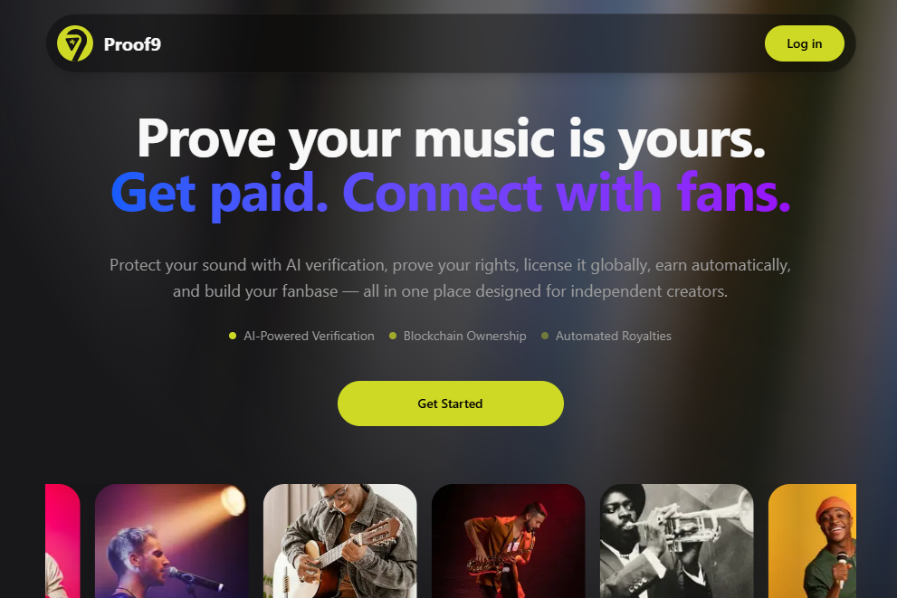
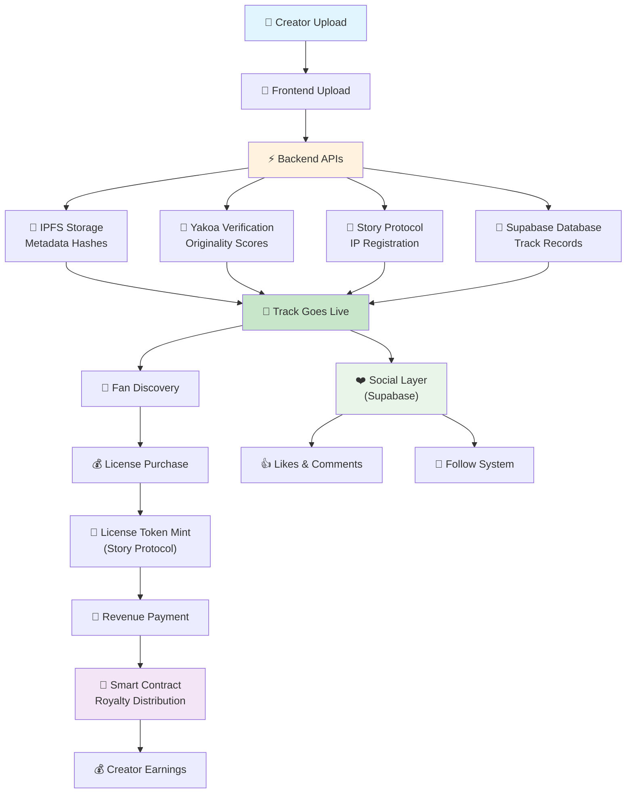

# Proof9 — Protect, license, and earn from your sound, on Story

Proof9 is a sound rights platform where music creators protect, license, and monetize their sound IP through on-chain ownership, AI-powered originality verification, and real social connection with their fans and audience — powered by Story Protocol, Yakoa, and Tomo.

## Problem

Music and sound creators struggle to prove ownership, protect their work, and monetize it effectively. Licensing is complicated, piracy is rampant, and current systems lack transparency, especially for independent artists and creators.

## Solution

Proof9 is a sound rights platform that gives creators the tools to protect their IP, verify originality, license usage, and get paid for their sound — all backed by on-chain provenance and AI verification. Beyond just payments, Proof9 creates real social connections between creators and their audience through social interactions. Powered by Story Protocol, Yakoa, and Tomo, creators can confidently manage their sound IP, build meaningful relationships with fans, and earn in a transparent, decentralized ecosystem.

## Features

-   **🔐 On-chain ownership** — Upload and register your sound IP with blockchain-backed provenance using Story Protocol.

-   **🧠 AI-powered verification** — Detect sound originality and infringement with Yakoa's content analysis.

-   **📜 Smart licensing** — Set clear usage terms and license your sound for B2B or creator use with traceable permissions.

-   **💸 Automated royalties** — Earn automatically when your sound is licensed and used, with smart contract-enforced revenue distribution.

-   **🤝 Social profiles & real fan connection** — Build community relationships through social profiles, likes, comments, and follow functionality.

-   **🚀 Seamless onboarding with Tomo Wallet** — Login or connect with familiar Web2 experience.

## How It Works

### For Creators

1. **Sign up & create your profile** — Connect with Tomo wallet and set up your creator profile
2. **Upload your sound & verify originality with AI** — Upload audio files and get AI-powered verification
3. **Register IP & set license terms on-chain** — Create IP assets with customizable licensing terms
4. **Share, track usage, and earn royalties** — Monitor your content and receive automated payments

### For Fans / Licensees

1. **Sign up & explore verified sound** — Discover AI-verified, blockchain-protected music
2. **View license terms & purchase usage rights** — Browse clear licensing options and mint license tokens
3. **Use and remix the sound confidently & track ownership** — Utilize licensed content with transparent provenance
4. **Support and connect with your favorite creators** — Access exclusive drops and build relationships

## User Flow & Technical Architecture



## Tech Stack

### Frontend

-   **Framework**: [Next.js 15](https://nextjs.org/)
-   **Language**: [TypeScript 5](https://www.typescriptlang.org/)
-   **Styling**: [Tailwind CSS 4](https://tailwindcss.com/)
-   **UI Library**: [Shadcn UI](https://ui.shadcn.com/)
-   **Theme**: [next-themes](https://github.com/pacocoursey/next-themes)
-   **Web3 Wallet & Social Login**: [Tomo SDK](https://docs.tomo.inc/tomo-sdk/tomoevmkit)
-   **Web3 Integration**: [wagmi](https://wagmi.sh/), [viem](https://viem.sh/)
-   **Forms & Validation**: [react-hook-form](https://react-hook-form.com/), [zod](https://zod.dev/)
-   **Data Fetching**: [TanStack Query](https://tanstack.com/query)

### Backend (API)

-   **Runtime**: [Bun](https://bun.sh/)
-   **Framework**: [Hono](https://hono.dev/)
-   **Language**: [TypeScript 5](https://www.typescriptlang.org/)
-   **Story Protocol**: [@story-protocol/core-sdk](https://docs.storyprotocol.xyz/)
-   **Yakoa AI Verification**: [Yakoa API](https://docs.yakoa.ai/)
-   **Onchain Storage**: [IPFS (via Pinata)](https://www.pinata.cloud/)
-   **Offchain Database**: [Supabase](https://supabase.com/) (PostgreSQL)
-   **Web3 Integration**: [viem](https://viem.sh/)
-   **Validation**: [zod](https://zod.dev/), [@hono/zod-validator](https://hono.dev/middleware/validator)

## Platform Features

### Story Protocol Integration

Proof9 utilizes Story Protocol for on-chain sound IP registration and smart licensing & royalty distribution:

**API Endpoints:**

-   **Sound IP Registration**: `POST /api/registration/register` - Register music as IP assets with commercial remix terms and royalty sharing (Story Protocol)
-   **Derivative Registration**: `POST /api/derivative/register` - Register remixes and covers as derivative IP assets (Story Protocol)
-   **License Token Minting**: `POST /api/licenses/mint` - Create transferable license tokens for commercial use (Story Protocol)
-   **Royalty Management**: `POST /api/royalty/pay`, `POST /api/royalty/claim` - Revenue distribution and collection (Story Protocol)

### Yakoa Integration

Proof9 integrates Yakoa for sound content verification:

**API Endpoints:**

-   **Content Registration**: `POST /api/verification/verify-music` - Register music tokens with Yakoa's verification service (Yakoa)
-   **Status Monitoring**: `GET /api/verification/status/:tokenId` - Check verification status and infringement detection results (Yakoa)
-   **Brand Authorization**: `POST /api/verification/authorize` - Manage brand permissions for licensed content (Yakoa)

### Additional Services

**Track Management:**

-   **Track Creation**: `POST /api/tracks` - Create track records in database with social features
-   **Track Discovery**: `GET /api/tracks` - Get tracks for discovery feed (latest, following, trending)
-   **Track Details**: `GET /api/tracks/:id` - Get individual track information and metadata

**Upload & Storage:**

-   **Media Upload**: `POST /api/upload/media` - Upload audio files to IPFS
-   **Image Upload**: `POST /api/upload/image` - Upload cover art to IPFS
-   **Avatar Upload**: `POST /api/upload/avatar` - Upload user avatars

**User Management:**

-   **Profile Creation**: `POST /api/users/create-profile` - Create user profiles with Web3 integration (Tomo)

## 📦 Project Structure

```
Proof9/
├── frontend/                 # Next.js frontend application
│   ├── src/
│   │   ├── app/             # App router pages
│   │   │   ├── (app)/       # Main app routes
│   │   │   │   ├── discover/    # Music discovery
│   │   │   │   ├── upload/      # Upload interface
│   │   │   │   ├── library/     # User library
│   │   │   │   ├── profile/     # User profiles
│   │   │   │   └── track/       # Track details
│   │   │   └── page.tsx     # Landing page
│   │   ├── components/      # Reusable components
│   │   │   ├── auth/        # Authentication components
│   │   │   ├── layout/      # Layout components
│   │   │   ├── providers/   # Web3 providers (Tomo)
│   │   │   ├── shared/      # Shared components
│   │   │   └── ui/          # UI components
│   │   ├── hooks/           # Custom hooks
│   │   ├── lib/             # Utilities and configurations
│   │   ├── styles/          # Styling files
│   │   └── types/           # TypeScript type definitions
│   └── package.json
├── backend/                  # Bun + Hono API server
│   ├── src/
│   │   ├── routes/          # API route handlers
│   │   │   ├── registration/    # IP registration (Story)
│   │   │   ├── derivative/      # Derivative IP registration (Story)
│   │   │   ├── licenses/        # License management (Story)
│   │   │   ├── verification/    # AI verification (Yakoa)
│   │   │   ├── royalty/         # Royalty distribution (Story)
│   │   │   ├── tracks/          # Track management
│   │   │   ├── upload/          # File uploads (IPFS)
│   │   │   └── users/           # User management
│   │   ├── services/        # External service integrations
│   │   │   └── yakoa.ts         # Yakoa AI verification service
│   │   ├── lib/             # Shared utilities
│   │   └── middleware/      # API middleware
│   ├── utils/               # Utility functions
│   ├── scripts/             # Deployment and utility scripts
│   └── package.json
└── README.md
```

## 🛠️ Setup & Installation

### Prerequisites

-   **Node.js 18+**
-   **Runtime & Package Manager**: [Bun](https://bun.sh/)
-   **Linting & Formatting**: [Biome](https://biomejs.dev/)

### Installation Steps

1. **Clone the repository**

    ```bash
    git clone https://github.com/samueldanso/Proof9.git
    cd Proof9
    ```

2. **Install dependencies**

    Install dependencies in both backend and frontend:

    ```bash
    # Install backend dependencies
    cd backend && bun install

    # Install frontend dependencies
    cd ../frontend && bun install
    ```

3. **Setup environment variables**

    Create `.env` files in both backend and frontend directories:

    ```bash
    # In backend directory
    cp .env.example .env

    # In frontend directory
    cp .env.example .env
    ```

    **Backend `.env` configuration:**

    ```env
    WALLET_PRIVATE_KEY=your_wallet_private_key
    PINATA_JWT=your_pinata_jwt_secret_key
    STORY_NETWORK=iliad
    YAKOA_API_KEY=your_yakoa_api_key
    YAKOA_SUBDOMAIN=your_yakoa_subdomain
    YAKOA_NETWORK=your_yakoa_network
    SUPABASE_URL=your_supabase_project_url
    SUPABASE_SERVICE_ROLE_KEY=your_supabase_service_role_key
    ```

    **Frontend `.env` configuration:**

    ```env
    NEXT_PUBLIC_APP_URL=http://localhost:3000
    NEXT_PUBLIC_TOMO_CLIENT_ID=your_tomo_client_id
    NEXT_PUBLIC_WALLETCONNECT_PROJECT_ID=your_walletconnect_project_id
    NEXT_PUBLIC_API_URL=http://localhost:3001
    NEXT_PUBLIC_SUPABASE_URL=your_supabase_url
    NEXT_PUBLIC_SUPABASE_ANON_KEY=your_supabase_anon_key
    ```

4. **Start the development servers**

    Run both backend and frontend in development mode:

    ```bash
    # Terminal 1: Start backend
    cd backend && bun run dev

    # Terminal 2: Start frontend
    cd frontend && bun run dev
    ```

    **Development URLs:**

    - **Frontend**: http://localhost:3000
    - **Backend API**: http://localhost:3001

## 📤 Deployment

### Frontend (Next.js) on Vercel

1. Connect your repository to [Vercel](https://vercel.com)
2. Configure environment variables in Vercel dashboard
3. Deploy on push to main branch

### Backend API (Bun) on Railway

1. Connect your repository to [Railway](https://railway.app)
2. Configure environment variables in Railway dashboard
3. Deploy the backend service

## 🗺️ Roadmap

### Current Features ✅

-   [x] Story Protocol IP registration and licensing
-   [x] Yakoa AI verification integration
-   [x] Tomo wallet authentication
-   [x] IPFS file storage
-   [x] Responsive UI with modern design
-   [x] Automated royalty distribution

### Upcoming Features 🚧

-   [ ] AI metadata generation
-   [ ] Advanced analytics dashboard
-   [ ] Mobile application
-   [ ] Enhanced social features

## 🤝 Contributing

1. Fork the repository
2. Create a feature branch (`git checkout -b feature/amazing-feature`)
3. Commit your changes (`git commit -m 'Add amazing feature'`)
4. Push to the branch (`git push origin feature/amazing-feature`)
5. Open a Pull Request

## 📄 License

This project is licensed under the MIT License - see the [LICENSE](LICENSE) file for details.

## 🔗 Links

-   **Live Demo**: [proof9.xyz](https://proof9.xyz)
-   **Documentation**: [Technical Paper](TECHNICAL_PAPER.md)
