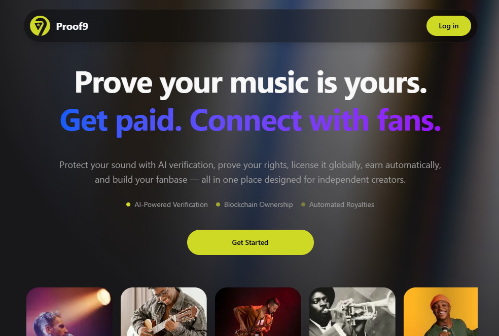

# Proof9 — Protect, license, and monetize your sound, on Story

Proof9 is a sound rights platform where music creators protect, license, and monetize their sound IP through on-chain ownership, AI-powered originality verification, and real connection with fans — powered by Story Protocol, Yakoa, and Tomo.

## Problem

Musuc creators struggle to prove ownership, protect their work, and monetize it effectively. Licensing is complicated, piracy is rampant, and current systems lack transparency, especially for independent artists.

## Solution

Proof9 is a sound rights platform that gives creators the tools to protect their IP, verify originality, license usage, and monetize their sound — all backed by on-chain provenance and AI verification. Powered by Story Protocol, Yakoa, and Tomo, creators can confidently manage and earn from their sound IP in a transparent, decentralized ecosystem.

## Features

-   **🔐 On-chain ownership** — Upload and register your sound IP with blockchain-backed provenance using Story Protocol.

-   **🧠 AI-powered verification** — Detect originality and duplicates with Yakoa's intelligent fingerprinting.

-   **📜 Smart licensing** — Set clear usage terms and license your sound for B2B or creator use with traceable permissions.

**💸 Automated royalties** — Earn automatically when your sound is licensed and used, remix tracked and enforced by smart contracts.

** 🤝 Social Profiles & Real fan connection** — Share exclusive drops, updates, and build community relationships via social profiles.

** Onboarding with Tomo Wallet ** - Login or Conect

## How it Works

### ⚙️ How It Works

### For Creators

1. **Sign up & create your profile**
2. **Upload your sound & verify originality with AI**
3. **Register IP & set license terms on-chain**
4. **Share, track usage, and earn royalties**

### For Fans / Licensees

1. **Sign up & explore verified sound**
2. **View license terms & purchase usage rights**
3. **Use the sound confidently & track ownership**
4. **Support and connect with your favorite creators and access exclusive drops**

## Tech Stack

### Frontend

-   **Framework**: [Next.js 15](https://nextjs.org/)
-   **Language**: [TypeScript 5](https://www.typescriptlang.org/)
-   **Styling**: [Tailwind CSS 4](https://tailwindcss.com/)
-   **UI Library**: [Shadcn UI](https://ui.shadcn.com/)
-   **Theme**: [next-themes](https://github.com/pacocoursey/next-themes)
-   **Web3 Wallet & Social Login**: [Tomo SDK](https://docs.tomo.inc/tomo-sdk/tomoevmkit)
-   **Web3 Integration**: [wagmi](https://wagmi.sh/), [viem](https://viem.sh/)
-   **Forms & Validation**: [react-hook-form](https://react-hook-form.com/), [zod](https://zod.dev/)
-   **Data Fetching**: [TanStack Query](https://tanstack.com/query)

### Backend (API)

-   **Runtime**: [Bun](https://bun.sh/)
-   **Framework**: [Hono](https://hono.dev/),
-   **Language**: [TypeScript 5](https://www.typescriptlang.org/)
-   **Story Protocol**: [@story-protocol/core-sdk](https://docs.storyprotocol.xyz/)
-   **Yakoa AI Verification**: [Yakoa API](https://docs.yakoa.ai/)
-   **Onchain Storage**: [IPFS (via Pinata)](https://www.pinata.cloud/)
-   **Offchain Database**: [Supabase](https://supabase.com/) (PostgreSQL)
-   **Web3 Integration**: [viem](https://viem.sh/)
-   **Validation**: [zod](https://zod.dev/), [@hono/zod-validator](https://hono.dev/middleware/validator)

## Story Protocol Integration

Proof9 utilizes Story Protocol for on-chain sound IP registration and smart licensing & royalty distribution:

### API Endpoints

-   **Sound IP Registration**: `POST /api/registration/register` - Register music as IP assets with commercial remix terms and royalty sharing
-   **License Token Minting**: `POST /api/licenses/mint` - Create transferable license tokens for commercial use
-   **Royalty Management**: `POST /api/royalty/pay`, `POST /api/royalty/claim` - Revenue distribution and collection
-   **Derivative management**:

## Yakoa Integration

Proof9 integrates Yakoa for sound content verification:

### API Endpoints

-   **Content Registration**: `POST /api/verification/verify-music` - Register music tokens with Yakoa's verification service
-   **Status Monitoring**: `GET /api/verification/status/:tokenId` - Check verification status and infringement detection results
-   **Brand Authorization**: `POST /api/verification/authorize` - Manage brand permissions for licensed content

## Architecture

## 📦 Project Structure

```

```

## 🛠️ Setup & Installation

### Prerequisites

-   Node.js 18+
-   **Runtime & Package Manager**: [Bun](https://bun.sh/)
-   **Backend Framework**: [Hono](https://hono.dev/)
-   **Linting & Formatting**: [Biome](https://biomejs.dev/)

1. **Clone the repository**

    ```bash
    git clone https://github.com/samueldanso/Proof9.git
    cd Proof9
    ```

2. **Install dependencies**

Install dependencies in both backend and frontend:

    ```bash
    bun install
    ```

3. Setup environment variables:

Create .env files in both backend and frontend:

    ```bash
    cp env.example .env
    ```

For `backends/.env`:

```
WALLET_PRIVATE_KEY=your_wallet_key
PINATA_JWT=your_pinata_jwt_secret_key
STORY_NETWORK=your_story_network
YAKOA_API_KEY=your_yakoa_api_key
YAKOA_SUBDOMAIN=your_yakoa_subdomain
YAKOA_NETWORK=your_yakoa_network
SUPABASE_URL=your_supabase_project_url
SUPABASE_SERVICE_ROLE_KEY=your_supabase_service_role_key

```

For `frontend/.env`:

```
NEXT_PUBLIC_APP_URL=your_app_url
NEXT_PUBLIC_TOMO_CLIENT_ID=your_tomo_client_id
NEXT_PUBLIC_WALLETCONNECT_PROJECT_ID=your_walletconnect_project_id
NEXT_PUBLIC_API_URL=your_api_url
NEXT_PUBLIC_SUPABASE_URL=your_supabase_url
NEXT_PUBLIC_SUPABASE_ANON_KEY=your_supabase_anon_key
```

4. Start the development server:

Run the development server in both backend and frontend

    ```bash
    bun run dev
    ```

This will start both the backend and frontens in development mode:

-   API: http://localhost:3001
-   Web: http://localhost:3000

## 📤 Deployment

### Frontend (Next.js) on Vercel

Deploy the frontend repository to [Vercel](https://vercel.com)

### Backend API (Bun) on Render

Deploy the backend repository web service on [Render](https://render.com)

## Roadmap

-   [ ] Implement AI Metadata genereration

## Contributing

1. Create a new branch
2. Make your changes
3. Submit a pull request
